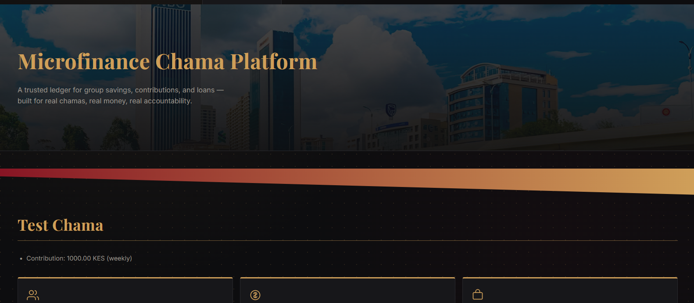
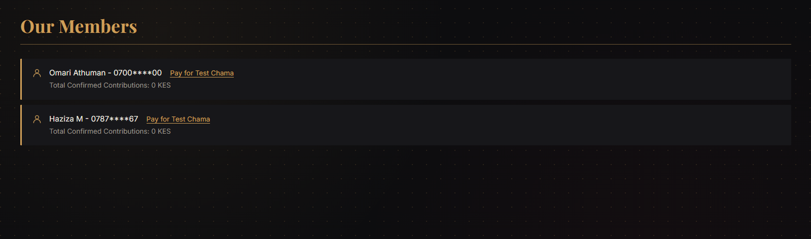
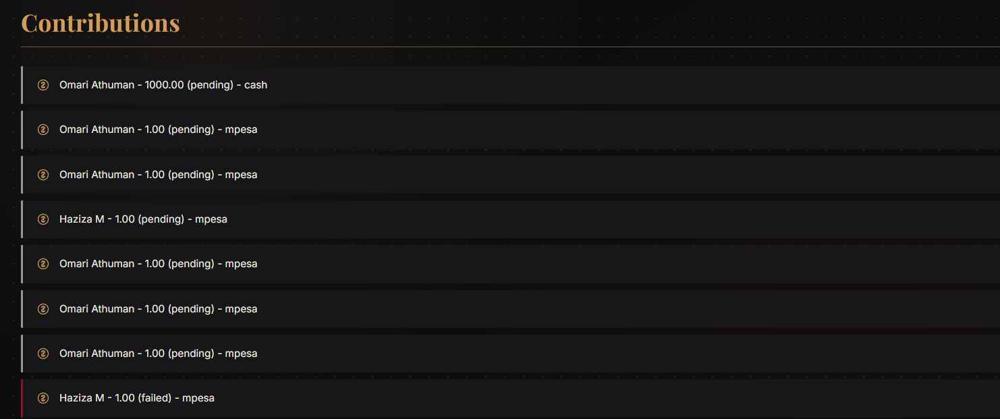
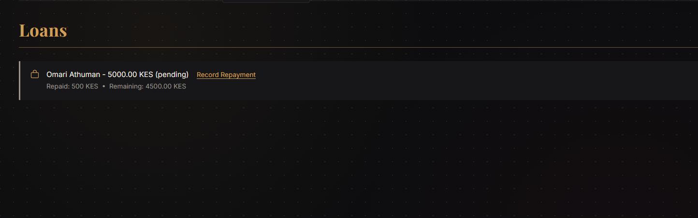

# Microfinance Chama Platform

A secure, single-organization web platform for managing group savings (chamas/SACCOs) - built with real M-Pesa Daraja API integration for automated contribution and loan repayment tracking.

## Overview

Many Kenyan chamas and SACCOs still rely on spreadsheets, WhatsApp groups, or manual cash handling to track member contributions and loans - leading to lost records, disputes, and inefficiency. This platform solves that by giving a single trusted administrator a real, auditable system: members pay directly via M-Pesa STK Push, payments are automatically verified against Safaricom's systems, and every contribution, loan, and repayment is permanently recorded.

## Features

- **Real M-Pesa Integration** - Live STK Push payment requests via Safaricom's Daraja API, with automatic callback handling that verifies and records payment outcomes without manual intervention
- **Financial Data Modeling** - Six connected models (Chama, Member, Membership, Contribution, Loan, Repayment) accurately reflecting real chama operations, including interest rates and repayment tracking
- **Secure Authentication** - Every page is protected; only the authenticated administrator can view or manage member and financial data
- **Live Dashboard** - Real-time statistics (member count, confirmed contributions, active loans) calculated directly from the database
- **Privacy-Conscious Design** - Sensitive data such as phone numbers are masked in the interface
- **Custom Visual Identity** - A distinctive black, gold, and red design system with an original hero section and consistent iconography throughout

## Tech Stack

- **Backend:** Django 6.0, Python 3.13
- **Database:** SQLite (development)
- **Payments:** Safaricom Daraja API (M-Pesa STK Push)
- **Frontend:** Django Templates, custom CSS (no framework)
- **Tools:** Git, GitHub, ngrok (for local webhook testing)

## Setup

1. Clone the repository and navigate into the project folder
2. Create and activate a virtual environment: `python -m venv venv` then `venv\Scripts\activate`
3. Install dependencies: `pip install -r requirements.txt`
4. Create a `.env` file with your Daraja API credentials (Consumer Key, Consumer Secret, Shortcode, Passkey)
5. Run migrations: `python manage.py migrate`
6. Create an admin account: `python manage.py createsuperuser`
7. Start the server: `python manage.py runserver`
8. Visit `http://127.0.0.1:8000/admin/` to log in

## Screenshots

### Dashboard

### Members

### Contributions

### Loans

